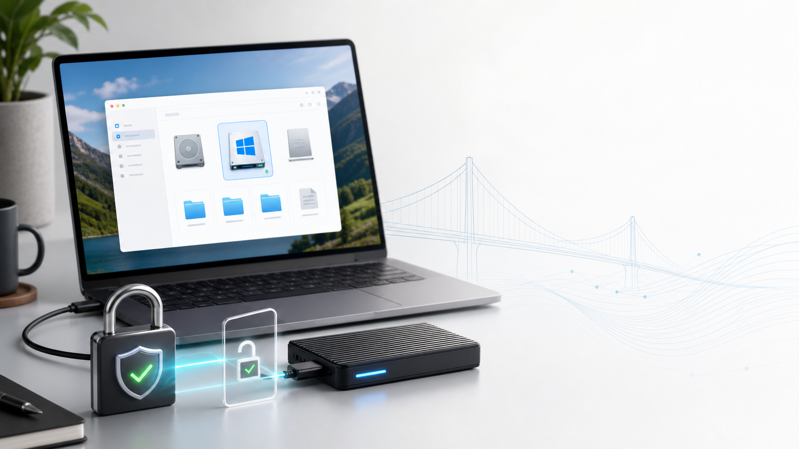
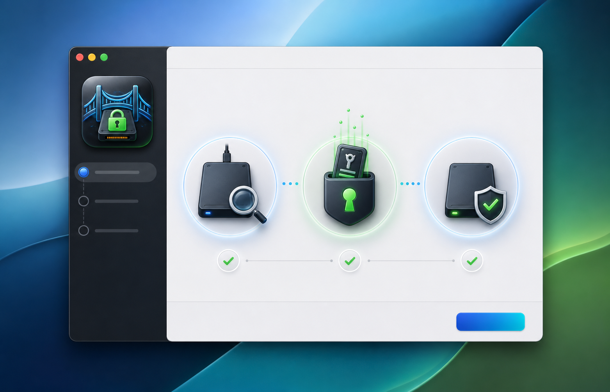

# BitBridge

<p align="center">
  
</p>

**BitBridge** is an open-source Apple Silicon macOS installer that helps mount BitLocker-encrypted Windows SSDs safely from Finder.

Open source, made by **@MESBAHI.taha**.

GitHub: [@taha-mesbahi](https://github.com/taha-mesbahi)

BitBridge wraps the excellent `anylinuxfs` workflow with a small GUI installer, Keychain-based recovery-key storage, and a LaunchAgent that automounts the selected BitLocker partition when the drive is plugged in.

## Why BitBridge?

Moving from a Windows laptop to a Mac can make a BitLocker SSD feel locked away. BitBridge keeps the setup approachable:

- Select the external BitLocker partition from a GUI.
- Store the recovery key in the macOS login Keychain.
- Mount the Windows volume read-only under `/Volumes`.
- Re-mount automatically after login when the SSD is plugged in.
- Keep the actual mount logic as simple shell scripts contributors can inspect.

<p align="center">
  
</p>

## Safety Model

BitBridge defaults to **read-only** mounting. That is intentional. NTFS writes from macOS can be risky, and BitLocker recovery workflows should not start by modifying the original Windows system disk.

The recovery key is not written to the LaunchAgent or scripts. It is stored with:

```text
macOS login Keychain -> io.github.taha-mesbahi.bitbridge.recovery-key.<partition-uuid>
```

## Requirements

- Apple Silicon Mac.
- macOS with `launchctl`, `osascript`, `security`, `diskutil`, and `hdiutil`.
- [`anylinuxfs`](https://github.com/akemin-dayo/anylinuxfs), installed in `/opt/homebrew/bin/anylinuxfs`.
- macFUSE, if required by your `anylinuxfs` setup.
- A valid BitLocker recovery key for the external drive.

## Install From The DMG

1. Download `BitBridge-Apple-Silicon.dmg` from Releases.
2. Open the DMG.
3. Run **BitBridge Installer.app**.
4. Choose the external BitLocker partition.
5. Paste the recovery key when prompted.
6. Enter your Mac administrator password when macOS asks to mount the volume.

After installation, BitBridge checks every 20 seconds after login. When the configured SSD is present, it mounts it automatically.

### Gatekeeper Note

The current build script creates an ad-hoc signed preview app. It is valid on disk, but it is **not Developer ID signed or notarized**, so macOS Gatekeeper may reject it for normal double-click launch.

For public releases, sign and notarize the app with an Apple Developer ID. Until then, testers may need to right-click **BitBridge Installer.app** and choose **Open**.

## Build The DMG

Clone the repo on an Apple Silicon Mac, then run:

```sh
./tools/build.sh
```

The output will be:

```text
dist/BitBridge-Apple-Silicon.dmg
```

The build creates:

- `BitBridge Installer.app`
- a macOS `.icns` app icon generated from `assets/bitbridge-icon-source.png`
- a compressed DMG ready to upload to GitHub Releases

## Manual Commands

Installed files live in:

```text
~/Library/Application Support/BitBridge
```

Manual mount:

```sh
"$HOME/Library/Application Support/BitBridge/bitbridge-mount.sh"
```

Manual unmount:

```sh
"$HOME/Library/Application Support/BitBridge/bitbridge-unmount.sh"
```

Logs:

```text
~/Library/Application Support/BitBridge/bitbridge.log
~/Library/Application Support/BitBridge/launchd.err.log
~/Library/Application Support/BitBridge/launchd.out.log
```

LaunchAgent:

```text
~/Library/LaunchAgents/io.github.taha-mesbahi.bitbridge.automount.plist
```

## Contributing

Good first issues:

- Improve dependency detection for `anylinuxfs` and macFUSE.
- Add localization for installer dialogs.
- Add safer drive identification with BitLocker metadata probing.
- Add a signed and notarized release pipeline.
- Improve UI with a native Swift installer.

See [CONTRIBUTING.md](CONTRIBUTING.md).

## Disclaimer

BitBridge is not affiliated with Microsoft, Apple, BitLocker, Homebrew, macFUSE, or anylinuxfs. It is a small open-source helper around existing macOS and open-source tools. Always keep backups before working with encrypted disks.
